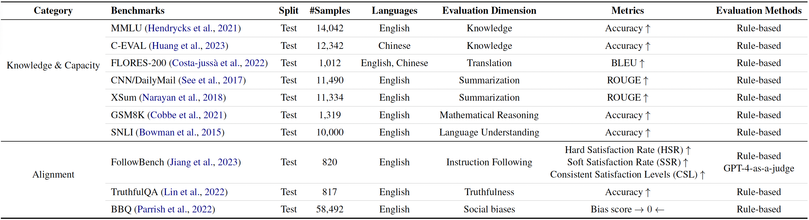

# A Comprehensive Evaluation of Quantization Strategies for Large Language Models

[**Paper**](https://aclanthology.org/2024.findings-acl.726/) |
[**Evaluation Framework**](#evaluation-framework) |
[**Benchmarks**](#benchmarks) |
[**Experiments**](#experiments) |
[**Acknowledgements**](#acknowledgements) |
[**Citation**](#citation)

## Evaluation Framework

The evaluation framework used in our study is depicted below. It assesses the quantized LLMs across three key dimensions: efficiency, knowledge & capacity, and alignment.


## Benchmarks

We utilize ten distinct benchmarks to comprehensively assess the instruction-tuned LLMs and their quantized counterparts. These benchmarks encompass both knowledge & capacity evaluation and alignment evaluation. By leveraging this broad spectrum of benchmarks, we aim to gain a holistic understanding of the models' performance across various dimensions, enabling a detailed comparison between the original and quantized versions of LLMs.

A comprehensive overview of the benchmarks employed in our study is presented below:



## Experiments

Detailed code and accompanying shell scripts for the quantization of LLMs can be found in the `quant` folder. Similarly, detailed code and shell scripts for the evaluation of the benchmarks used in our paper can be found in the `benchmarks` folder.

Please note that the shell scripts in this repository are not fully cleaned; modifications may be necessary to adapt them to your specific use case.

## Acknowledgements

We are deeply grateful for the support of Xiaomi AI Lab, without which this repository would not have been possible. Furthermore, we would like to thank the anonymous reviewers for their insightful comments.


## Citation
```
@inproceedings{jin-etal-2024-comprehensive,
    title = "A Comprehensive Evaluation of Quantization Strategies for Large Language Models",
    author = "Jin, Renren  and
      Du, Jiangcun  and
      Huang, Wuwei  and
      Liu, Wei  and
      Luan, Jian  and
      Wang, Bin  and
      Xiong, Deyi",
    editor = "Ku, Lun-Wei  and
      Martins, Andre  and
      Srikumar, Vivek",
    booktitle = "Findings of the Association for Computational Linguistics ACL 2024",
    month = aug,
    year = "2024",
    address = "Bangkok, Thailand and virtual meeting",
    publisher = "Association for Computational Linguistics",
    url = "https://aclanthology.org/2024.findings-acl.726",
    doi = "10.18653/v1/2024.findings-acl.726",
    pages = "12186--12215",
    abstract = "Increasing the number of parameters in large language models (LLMs) usually improves performance in downstream tasks but raises compute and memory costs, making deployment difficult in resource-limited settings. Quantization techniques, which reduce the bits needed for model weights or activations with minimal performance loss, have become popular due to the rise of LLMs. However, most quantization studies use pre-trained LLMs, and the impact of quantization on instruction-tuned LLMs and the relationship between perplexity and benchmark performance of quantized LLMs are not well understood. Evaluation of quantized LLMs is often limited to language modeling and a few classification tasks, leaving their performance on other benchmarks unclear. To address these gaps, we propose a structured evaluation framework consisting of three critical dimensions: (1) knowledge {\&} capacity, (2) alignment, and (3) efficiency, and conduct extensive experiments across ten diverse benchmarks. Our experimental results indicate that LLMs with 4-bit quantization can retain performance comparable to their non-quantized counterparts, and perplexity can serve as a proxy metric for quantized LLMs on most benchmarks. Furthermore, quantized LLMs with larger parameter scales can outperform smaller LLMs. Despite the memory savings achieved through quantization, it can also slow down the inference speed of LLMs. Consequently, substantial engineering efforts and hardware support are imperative to achieve a balanced optimization of decoding speed and memory consumption in the context of quantized LLMs.",
}
```
